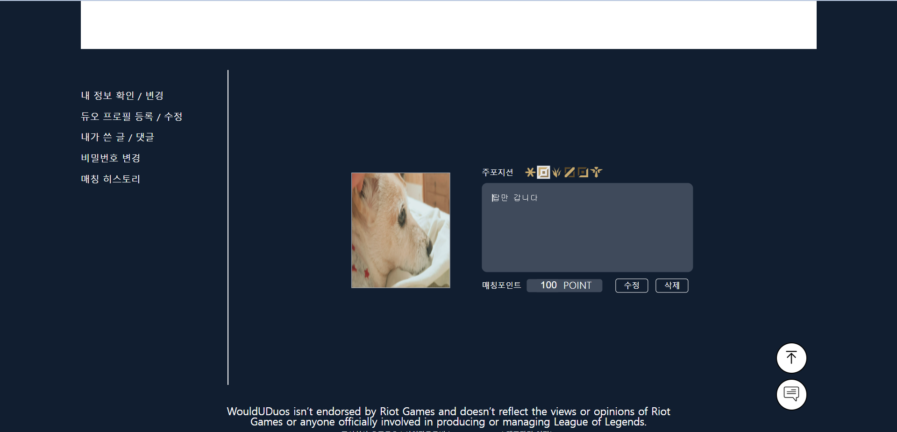
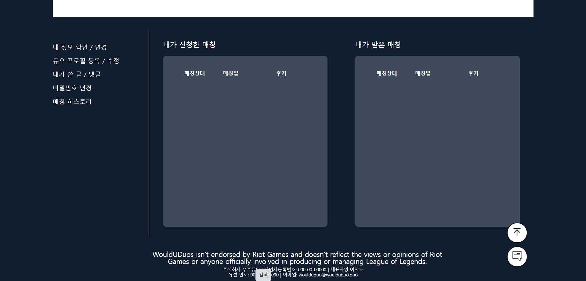
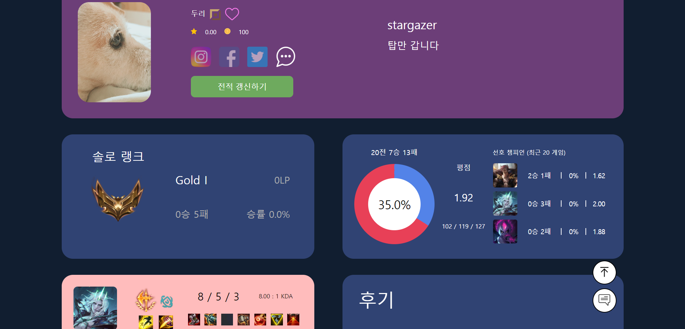
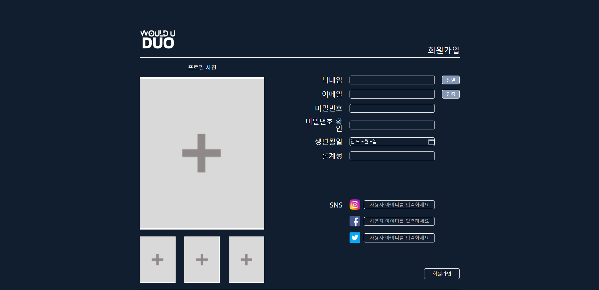

# Would U Duo

<div align="center">

[](https://hits.seeyoufarm.com)

</div>

## Would U Duo : Find League of Legend Duo Player v1.1

> 중앙정보처리학원 데이터융합 자바(JAVA) 응용 SW개발자 취업과정 1조 <br>
> 풀 스택 개발 학습 <br>
> 개발기간 : 2023.05.30 ~ 2023.07.04 (v1.0) <br>
>                     ~ 2023.07.11 (v1.1) : 전적 정보 데이터베이스에 저장 <br>

## About Team

- 이진호
  - PM
  - ERD / UML 설계
    - 데이터베이스 테이블 설계
    - 클래스 다이어그램 설계
    - 프로젝트 디렉토리 구조 설계
  - Common
    - 모달 열기 및 닫기 이벤트
    - 드롭다운 열기 및 닫기 이벤트
  - Header
    - 전체 와이어프레임 디자인
    - 로그인 드롭다운 html, css
    - 위로가기 버튼 구현
  - Main page
    - 전체 와이어프레임 디자인
  - Sign-up page
    - 전체 html, css
  - My page
    - 매칭 내역 렌더링
    - 리뷰 쓰기 기능 구현
    - 듀오 등록 시 티어 정보 및 최근 전적 정보 통계하여 DB에 저장
  - User history page
    - 전체 와이어프레임 디자인
    - 전체 html, css
    - 데이터베이스에서 사용자 정보 렌더링
  - 채팅 목록 모달
    - 전체 와이어프레임 디자인
  - 채팅창 모달
    - 전체 와이어프레임 디자인
  - PPT 제작 및 발표

- 한세진
  - ERD / UML 설계
    - 데이터베이스 테이블 설계
    - 클래스 다이어그램 설계
  - Design
    - 파비콘, 로그
    - 푸터
    - 회원가입 페이지
    - 메인 페이지 (팀 공통)
    - 마이페이지 전체
  - html, css
    - 메인 페이지
    - 듀오프로필 등록 페이지
    - 출석체크 페이지
    - 내정보 확인 / 변경
    - 후기 작성 모달
    - 매칭일자 선택 달력 모달
  - Sign-in
    - 로그인 완료시 로그인 요청했던 페이지로 이동 기능 구현
  - Chatting
    - 프로필카드 채팅 아이콘 클릭시 채팅 신청
    - 채팅 신청시 새로운 채팅방 생성 및 메세지창 팝업
    - 새로운 채팅 요청받을 경우 실시간 채팅목록 렌더링
    - 채팅목록에서 특정 채팅방 클릭하면 메세지 불러오기 및 메세지 읽음 처리
    - 채팅버튼에 안 읽은 메세지 수 실시간 렌더링
    - 채팅목록 버튼, 메세지창 뒤로가기 클릭시 채팅목록 다시 불러오기
    - 상대방이 메세지 보낼때마다 내가 안읽은 메세지 숫자 실시간 증가
    - 내 메세지 상대메세지 구분하여 메세지창에 렌더링
  - Matching
    - 매칭 신청버튼 클릭시 현재 가용포인트 조회하여 매칭신청 가능여부 알림
    - 매칭신청시 내 버튼은 매칭대기, 상대버튼은 매칭 확정 & 매칭거절로 실시간 변경
    - 매칭확정시 신청한 사용자 포인트 차감
    - 매칭확정 버튼 누르면 달력모달 뜨기
    - 달력에서 날짜 선택하면 내 버튼은 매칭완료, 상대방 버튼은 게임완료 버튼으로 실시간 변경
    - 매칭 거절버튼 누르면 내 버튼은 매칭대기, 상대방 버튼은 매칭신청으로 변경
    - 게임완료 버튼 누르면 내 버튼은 매칭 신청, 상대방 버튼은 포인트 받기로 실시간 변경
    - 포인트받기 버튼 누르면 매칭포인트 지급 및 매칭대기 버튼으로 변경
    - 메세지창 진입시 매칭 STATUS에 따라 매칭버튼 다르게 렌더링
    - 게임완료 후 채팅방 진입할 때 해당 매칭번호로 포인트 지급되었는지 여부 검사 하여
    - 지급받았으면 매칭대기, 안 받았으면 포인트 받기 버튼으로 출력

- 조성훈
  - ERD / UML 설계
    - 클래스 다이어그램 설계
  - Sign-up
    - 프로필 이미지 최대4장까지 첨부 가능
    - 항목 입력시 입력값 검증 유효성 검사
    - 아이디(이메일), 닉네임, 롤계정 중복검사
    - 아이디(이메일) 인증 이메일 발송 및 인증번호 확인
    - 비밀번호 회원가입 시 암호화하여 DB에 저장
    - 회원가입 필수값(닉네임,이메일,비밀번호,생년,롤계정) 입력하지 않으면 회원가입 실패
  - Sign-in
    - 회원가입 여부 확인
    - 비밀번호 일치 확인
    - 자동로그인 체크 여부 확인
    - 자동로그인 수명90일 설정
  - Sign-out
    - 자동로그인 중이라면 자동로그인 상태 해제
    - 세션에서 로그인 정보 제거
    - 세션 초기화
  - My page - 내정보 확인 / 변경
    - 로그인 한 사용자 정보 가져오기
    - 프로필 사진(가장 최근에 저장) 표시
    - 가입 정보(닉네임,생년,롤계정, sis) 다른 값 입력 후 저장시 정보 변경 업데이트

- 이동우
  - ERD / UML 설계
    - 데이터베이스 테이블 설계
    - 클래스 다이어그램 설계 
  - Design
    - 회원가입 페이지
    - 메인 페이지 (팀 공통)
    - 관리자페이지 전체
    - 관리자 유저 detail 페이지
  - html, css
    - 관리자페이지
    - 관리자 상세 페이지
    - 경고창 모달
    - PPT제작(공통)
  - Admin page
    - 관리자 메인페이지
      - userlist 목록 구현
      - boardlist 목록 구현
      - accuselist 목록구현
      - 각 리스트 count 구현
      - 각 list 페이징처리 구현
      - 각 list 검색기능구현
      - 게시글삭제기능
      - 게시글 삭제시 비동기 update
    - user detail 페이지
      - 포인트 지급 기능
      - 포인트 추가시 비동기 update
      - user detail 정보 동기 처리
      - 경고처리
      - 경고 처리후 페이지 유입시 경고 목록 유지처리
      - 회원 경고시 모달 + 경고 데이터 정보 처리
      - 5회 경고시 회원 자동 Ban처리
      - 회원 Ban 유효성검사
      - 회원 Ban 처리
      - BAN 처리후 페이지 유입시 BAN 상태 유지처리

- 이진수
  - ERD / UML 설계
    - 클래스 다이어그램 설계
  - Design
    - 게시글상세페이지
    - 커뮤니티 글쓰기모달
    - 커뮤니티 신고하기모달
    - 커뮤니티 글 상세보기
    - 커뮤니티 로그인 알림모달
  - html, css
    - 푸터
    - 비밀번호 재설정 모달
    - 마이페이지 비밀번호변경
    - 마이페이지 듀오매칭내역
  - Community
    - 게시글쓰기

- 홍성준
  - ERD / UML 설계
    - 데이터베이스 테이블 설계
    - 클래스 다이어그램 설계 
  - Design
    - 커뮤니티 페이지
    - 커뮤니티 글쓰기 모달
    - 로그인 안한 상태 서비스 이용불가 모달
    - 마이페이지 - 출석체크 페이지
  - html, css
    - 커뮤니티 페이지
    - 마이페이지 - 내가 쓴 게시글 / 댓글 페이지
    - 포인트 충전소 페이지
    - 채팅창 모달
    - 채팅 상세내역 모달
  - My page
    - 프로필카드 등록시 미선택 값이 존재하는지 검증
    - 매칭포인트 최대 숫자 3자리까지만 입력 제한
    - 세션에 매칭포인트가 담겨있는지 체크 후 기존 등록되어있는 프로필카드 내용 입력란에 띄워주기
    - 세션에 기존 프로필카드 등록정보가 있으면 수정, 삭제 버튼 띄우기
    - 프로필 카드 등록기능
    - 프로필 카드 수정기능
    - 프로필 카드 삭제기능
  - Main page
    - JPA 라이브러리 QueryDSL Cofig파일 세팅
    - 프로필카드 비동기 요청으로 화면에 렌더링하기
    - 검색창에 키워드 입력시 onkeyup을 이용해 서버로 비동기 요청
    - 티어, 포지션, 성별, 팔로잉 버튼 선택시마다 서버로 비동기 요청
    - 별점순, 매칭률순 정렬 조건 선택시 서버로 비동기 요청
    - 스크롤이 페이지 최하단 위치시 다음 페이지가 열리는 무한 스크롤 기능
    - 스크롤이 최하단에 위치했을 때 데이터로드가 끝나지 않은 경우 중복되지않게 동일데이터로드 막기
    - 서버에서 받아온 tier를 변환하여 각 티어마다 해당이미지 삽입
    - 팔로잉 상태에 따라 하트이미지 주기
    - sns null인 경우 아이콘이미지도 숨기기
    - QueryDSL을 이용하여 동적 파라미터 처리 하여 필터링 조회 가능 (닉네임 검색, 티어별, 포지션별, 성별, 팔로잉)
    - 별점순 정렬기능
    - QueryDSL의 offset과 limit를 이용하여 페이징 처리
    - 하트버튼 클릭시 팔로우/언팔로우 기능

## About Project


함께 즐거운 게임 플레이를 하고 싶은 사람들을 위한 웹사이트입니다.

## Stacks

### Language

<div>

 
 
 
 

</div>

### Framework & Database

<div>


 

</div>

### Dependencies

<div>


</div>

### IDE

<div>

 


</div>

### Environment

<div>

 


</div>

## Pages

### Main Page


### My Page - 내 정보 확인 및 변경


### My Page - 듀오 프로필 등록 및 수정



### My Page - 매칭 내역 확인



### History Page



### Sign Up Page



### Chatting Modal

<div align="center">


<br>


</div>

### Admin Page - Main


### Admin Page - Detail


### Admin Page - Accuse Modal


### Community - Board Register


## Structure

```
├─.gradle
│  ├─7.6.1
│  │  ├─checksums
│  │  ├─dependencies-accessors
│  │  ├─executionHistory
│  │  ├─fileChanges
│  │  ├─fileHashes
│  │  └─vcsMetadata
│  ├─buildOutputCleanup
│  └─vcs-1
├─.idea
│  ├─dataSources
│  │  ├─60e32876-ec6b-4081-a028-3b75ef9f7597
│  │  │  └─storage_v2
│  │  │      └─_src_
│  │  │          └─schema
│  │  └─f30bda4e-63d7-4667-8eb8-1faa35ee3da1
│  │      └─storage_v2
│  │          └─_src_
│  │              └─schema
│  └─modules
├─build
│  ├─classes
│  │  └─java
│  │      └─main
│  │          └─site
│  │              └─woulduduo
│  │                  ├─api
│  │                  ├─aws
│  │                  ├─config
│  │                  ├─controller
│  │                  ├─dto
│  │                  │  ├─request
│  │                  │  │  ├─accuse
│  │                  │  │  ├─board
│  │                  │  │  ├─chatting
│  │                  │  │  ├─login
│  │                  │  │  ├─matching
│  │                  │  │  ├─page
│  │                  │  │  ├─profile
│  │                  │  │  └─user
│  │                  │  ├─response
│  │                  │  │  ├─accuse
│  │                  │  │  ├─board
│  │                  │  │  ├─chatting
│  │                  │  │  ├─login
│  │                  │  │  ├─page
│  │                  │  │  ├─profile
│  │                  │  │  └─user
│  │                  │  └─riot
│  │                  ├─entity
│  │                  ├─enumeration
│  │                  ├─exception
│  │                  ├─interceptor
│  │                  ├─repository
│  │                  ├─service
│  │                  └─util
│  │                      └─upload
│  ├─generated
│  │  └─sources
│  │      ├─annotationProcessor
│  │      │  └─java
│  │      │      └─main
│  │      │          └─site
│  │      │              └─woulduduo
│  │      │                  └─entity
│  │      └─headers
│  │          └─java
│  │              └─main
│  ├─resources
│  │  └─main
│  │      └─static
│  │          └─assets
│  │              ├─css
│  │              │  ├─ad
│  │              │  ├─admin
│  │              │  ├─board
│  │              │  ├─chatting
│  │              │  ├─common
│  │              │  ├─error
│  │              │  ├─my-page
│  │              │  ├─point
│  │              │  ├─review
│  │              │  └─user
│  │              │      └─history
│  │              ├─img
│  │              │  ├─admin
│  │              │  ├─chattingModal
│  │              │  ├─community
│  │              │  ├─header
│  │              │  ├─main
│  │              │  ├─mypage
│  │              │  ├─pointStation
│  │              │  ├─sign-up
│  │              │  └─user-history
│  │              │      ├─champions
│  │              │      ├─item
│  │              │      ├─rune
│  │              │      │  ├─main
│  │              │      │  └─sub
│  │              │      └─spell
│  │              └─js
│  │                  ├─ad
│  │                  ├─amdin
│  │                  ├─board
│  │                  ├─chatting
│  │                  ├─common
│  │                  ├─my-page
│  │                  ├─point
│  │                  ├─review
│  │                  └─user
│  │                      └─history
│  └─tmp
│      └─compileJava
│          └─compileTransaction
│              ├─annotation-output
│              │  └─site
│              │      └─woulduduo
│              │          └─entity
│              ├─compile-output
│              │  └─site
│              │      └─woulduduo
│              │          ├─api
│              │          ├─config
│              │          ├─controller
│              │          ├─dto
│              │          │  ├─request
│              │          │  │  ├─accuse
│              │          │  │  ├─board
│              │          │  │  └─page
│              │          │  ├─response
│              │          │  │  ├─accuse
│              │          │  │  ├─board
│              │          │  │  ├─chatting
│              │          │  │  ├─login
│              │          │  │  └─user
│              │          │  └─riot
│              │          ├─entity
│              │          ├─exception
│              │          ├─interceptor
│              │          ├─repository
│              │          ├─service
│              │          └─util
│              ├─header-output
│              └─stash-dir
├─gradle
│  └─wrapper
├─readme-assets
└─src
    ├─main
    │  ├─java
    │  │  └─site
    │  │      └─woulduduo
    │  │          ├─api
    │  │          ├─aws
    │  │          ├─config
    │  │          ├─controller
    │  │          ├─dto
    │  │          │  ├─request
    │  │          │  │  ├─accuse
    │  │          │  │  ├─board
    │  │          │  │  ├─chatting
    │  │          │  │  ├─login
    │  │          │  │  ├─matching
    │  │          │  │  ├─page
    │  │          │  │  ├─profile
    │  │          │  │  └─user
    │  │          │  ├─response
    │  │          │  │  ├─accuse
    │  │          │  │  ├─ad
    │  │          │  │  ├─board
    │  │          │  │  ├─chatting
    │  │          │  │  ├─login
    │  │          │  │  ├─page
    │  │          │  │  ├─profile
    │  │          │  │  └─user
    │  │          │  └─riot
    │  │          ├─entity
    │  │          ├─enumeration
    │  │          ├─exception
    │  │          ├─interceptor
    │  │          ├─repository
    │  │          ├─service
    │  │          └─util
    │  │              └─upload
    │  ├─resources
    │  │  └─static
    │  │      └─assets
    │  │          ├─css
    │  │          │  ├─ad
    │  │          │  ├─admin
    │  │          │  ├─board
    │  │          │  ├─chatting
    │  │          │  ├─common
    │  │          │  ├─error
    │  │          │  ├─my-page
    │  │          │  ├─point
    │  │          │  ├─review
    │  │          │  └─user
    │  │          │      └─history
    │  │          ├─img
    │  │          │  ├─admin
    │  │          │  ├─chattingModal
    │  │          │  ├─community
    │  │          │  ├─header
    │  │          │  ├─main
    │  │          │  ├─mypage
    │  │          │  ├─pointStation
    │  │          │  ├─sign-up
    │  │          │  └─user-history
    │  │          │      ├─champions
    │  │          │      ├─item
    │  │          │      ├─rune
    │  │          │      │  ├─main
    │  │          │      │  └─sub
    │  │          │      └─spell
    │  │          └─js
    │  │              ├─ad
    │  │              ├─amdin
    │  │              ├─board
    │  │              ├─chatting
    │  │              ├─common
    │  │              ├─my-page
    │  │              ├─point
    │  │              ├─review
    │  │              └─user
    │  │                  └─history
    │  └─webapp
    │      └─WEB-INF
    │          └─views
    │              ├─ad
    │              ├─admin
    │              ├─board
    │              ├─chatting
    │              ├─common
    │              ├─error
    │              ├─my-page
    │              ├─point
    │              └─user
    └─test
        └─java
            └─site
                └─woulduduo
                    └─service

```